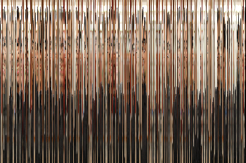

# Sorting Randomized Images and the Visualization of Sorting Algorithms
[](https://opensource.org/licenses/MIT)
[](https://www.python.org/)<br/>

## Getting Started :heavy_check_mark:
### Prerequisites
This program uses the following Python modules:

- Pillow
```
pip install Pillow
```

- NumPy
```
pip install numpy
```

- OpenCV
```
pip install opencv
```

- The H264 video codec must also be installed becuase OpenCV does not include
it in the default installation. <br/>
After downloading, unzip the file, then place the .dll file in the same directory as main.py. <br/>
Download the latest release from here: https://github.com/cisco/openh264/releases

### Installation
All there is to do is clone this repository.
```
git clone https://github.com/stinsan/Sorting-Randomized-Images.git
```

## Running the Program :runner:
The program is invoked by the following command:
```
python main.py <sorting_algorithm>
```

The <sorting_algorithm> parameter can be one of the following: 

| Parameter Name | Sorting Algorithm Used|
|----------------|-------------------|
|bubble|Bubblesort|
|insert|Insertion Sort|
|select|Selection Sort|
|merge|Merge Sort|
|quick|Quicksort|
|heap|Heapsort|
|count|Counting Sort|
|radix|Radix Sort|
|bucket|Bucket Sort|

If no parameter is set, the program defaults to using bubblesort.

Then, the user will be prompted to select an image that will be randomized and sorted.

After a few seconds, a video showing the sorting algorithm at work will open and begin playing.
This video will also be saved in the same directory as the program as "result.mp4".

The statistics of the sorting algorithm, such as the number of array comparisons and
swaps, will also be output to the terminal.

## Examples and Results :100:
Here is an example of how this program works and the results that come from it.

Take this cute picture of myself as the input image:


This is the image after randomization:



This is a snippet of the resulting video showing a visualization of how the 
sorting algorithm works  (bubblesort, in this case):


These are the statistics that are printed to the terminal:


## TODO :scroll:

- Insertion sort
- ~Selection sort~
- Merge sort
- Quicksort
- Heapsort
- Counting sort
- Radix sort
- Bucket sort
- GUI
- Optimizations

